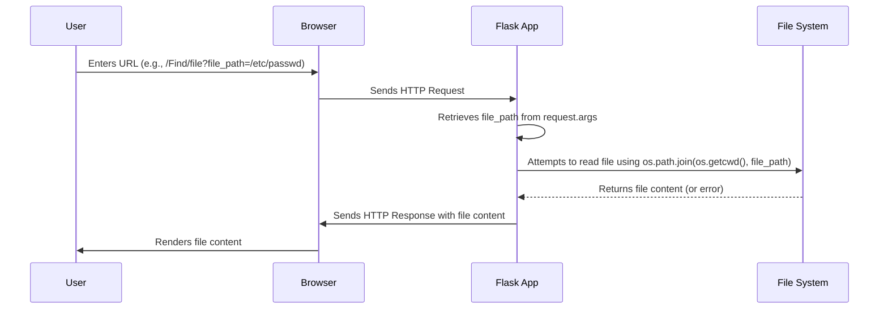

# LFI-LAB

## Overview

This is a simple Flask application demonstrating a Local File Inclusion (LFI) vulnerability. The application allows users to specify a file path, which is then used to display the contents of the file.  This is for educational purposes to illustrate the dangers of LFI vulnerabilities.  **This application should not be deployed in a production environment.**

## Vulnerability

The `/Find/file` route is vulnerable to LFI. It uses `send_file` from Flask to serve files based on the `file_path` parameter provided in the request.  Since the application directly uses user-supplied input to construct the file path without proper sanitization or validation, an attacker can read arbitrary files from the server's file system.

## File Structure

zero0x00-lfi-lab/
├── README.md             # This file
├── LICENSE               # License information
├── app.py                # Flask application code
├── requirment.txt        # Python dependencies
├── static/               # Static assets
│   ├── css/
│   │   └── styles.css    # CSS styles
│   └── js/
│       └── script.js     # JavaScript code
└── templates/            # HTML templates
├── Find.html         # Find page template
└── home.html         # Home page template


## Setup

1.  **Clone the repository:**

    ```bash
    git clone <repository_url>
    cd LFI-LAB
    ```

2.  **Create a virtual environment:**

    ```bash
    python3 -m venv venv
    source venv/bin/activate
    ```

3.  **Install dependencies:**

    ```bash
    pip install -r requirment.txt
    ```

4.  **Run the application:**

    ```bash
    python app.py
    ```

## Usage

1.  Navigate to the home page at `/`.
2.  Click on the link to `/Find`.
3.  Observe the Genie image and the button to vanish it.
4.  After vanishing the Genie, an input field appears.  This input field is **not** directly related to the LFI vulnerability.
5.  The LFI vulnerability is accessible through the `/Find/file` endpoint. You can try to access different files using the `file_path` parameter.

    Example: `/Find/file?file_path=/etc/passwd`

## Disclaimer

This application is intended for educational purposes only. Do not deploy it in a production environment.  The LFI vulnerability is intentional and should be used to understand the risks associated with such vulnerabilities.  The hardcoded AWS keys in `static/js/script.js` are for testing purposes only and are non-functional.

## License

[MIT License](https://github.com/Zero0x00/LFI-LAB/blob/main/LICENSE)

Copyright (c) 2024 Zero (Arif)


